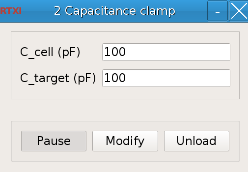
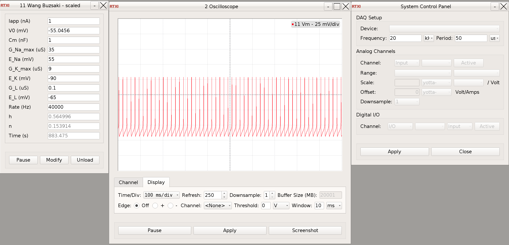
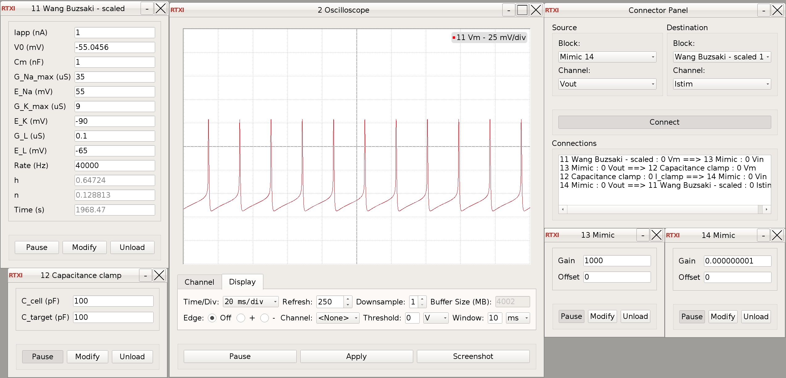
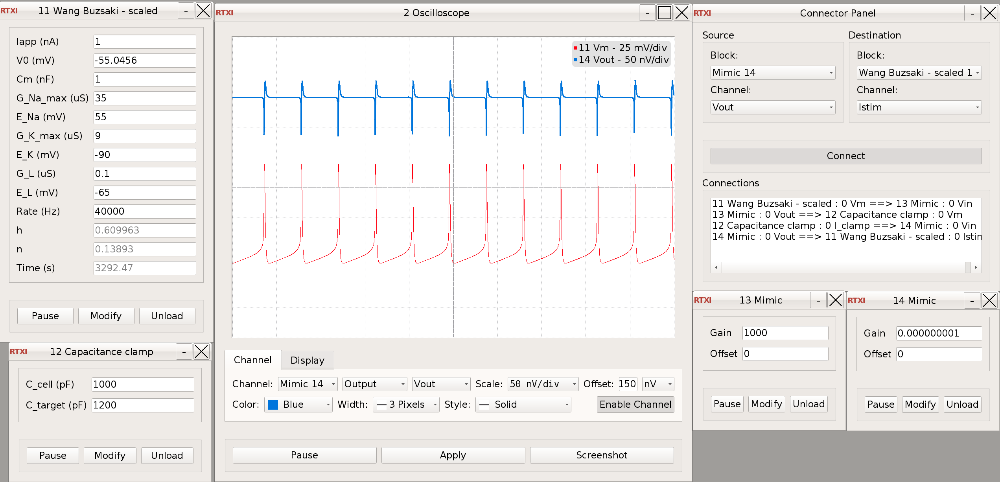
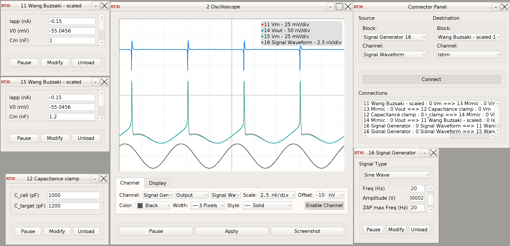

### Capacitance clamp

**Requirements:** None  
**Limitations:** None  



<!--start-->
Capacitance clamp module for [RTXI](http://rtxi.org)
<!--end-->

#### Input
1. Vm - Membrane potential in mV

#### Output
2. I_clamp - Capacitance clamp current in nA
####Parameters
1. C_cell (pF) - Actual capacitance of the cell in pF
2. C_tagret (pF) - Target capacitance in pF

#### States
None


#### Using the capacitance clamp module

The capacitance clamp module allows to study how a change of the cell's membrane capacitance affect the electrical
 dynamics of the cell. To emulate a capacitance change, the module requires the user to specify the measured cell
  capacitance and the target capacitance.

**Tutorial with a neuron model**

Aim: Connect the capacitance clamp module to a neuron model and change the neuron's capacitance.

Requirements: Besides the system modules of RTXI, only the [Wang-Buzsaki module](http://rtxi.org/modules/wang-buzsaki/) is required (or any other available
 neuron model).
1. Start RTXI, load the [oscilloscope](http://rtxi.org/docs/manual/#oscilloscope) and a Wang-Buzsaki neuron model
. If possible, set the frequency to 20kHz in System -> Control Panel to get a sufficiently high update rate. 
2. Monitor the membrane potential the neuron model in the oscilloscope.
  
3. Load the capacitance clamp module and connect it to the neuron.
  
   To connect it to the neuron, the output voltage of the neuron has to be connected to the input voltage of the
   capacitance clamp module and the output current of the capacitance clamp to the input current of the neuron. For
    this, load the module System -> Connector. As the units differ between the two modules, use the Utilities
     -> Utilities -> mimic_signal.so to match them.
     - Neuron-Model -> Mimic Signal 1 Gain: 1000 (from V to mV) -> Capacitance Clamp
     - Capacitance Clamp -> Mimic Signal 2 Gain: 1e-9 (from nA to A) -> Neuron Model
     
4. Monitor the capacitance clamp current in the oscilloscope. Unpause the capacitance clamp module and the two mimic
 signal module. The current should stay zero as cell and target capacitance are the same. Tip: As the current is in
  nA, it can get quite big which is hard to monitor in the oscilloscope. Monitor the corresponding mimic signal
   instead (e.g at 50nV/div with a offset of 100nV).
5. Turn on the capacitance clamp. 
    * Adjust cell capacitance to the capacitance of the neuron model, which is 1nF=1000pF
(in a real
 experiment this would be the measured one)
     * Set the target capacitance to 1200pF.
     * You should observe a change in the spike shape, when the capacitance clamp is turned on (reduced spike height
      and afterhyperpolarization). The capacitance clamp current should show a trace that look like inverted membrane
       current: during each spike, the current first works against the sodium current and then against the potassium
        current, thereby slowing down the neuron and thereby emulating the capacitance change.
        
6. Compare with the behaviour of a neuron with an actually different capacitance.
    * Add another Wang-Buzsaki neuron and monitor its voltage on the oscilloscope. Adjust the Cm to 1.2nF, so that it
     matches the target capacitance specified for the other neuron.
     * The spike shapes should match, but they should be slightly out of tune. The capacitance clamp needs to
      estimate the current flow and inject a corresponding scaled version of this current, this leads to a small
       error. Additionally, the numerical procedure behind the neuron model can induce a mistake. 
       * For a better comparison, lock the two neurons via an external signal, e.g. Utitlities -> Signals
        -> signal_generator.so. (see picture below for settings of the signal and the applied currents in the neuron)
        
    

#### Possible extensions
- optional connecting to a membrane capacitance measurement module that allows to automatically measure capacitance and set the cell capacitance


#### Development

Tests written with [gtest](https://github.com/google/googletest/blob/master/googletest/docs/primer.md). Gtests is
 part of the repro as a [git submodule](https://git-scm.com/book/de/v1/Git-Tools-Submodule). To download it run
 ```
git submodule init
git submodule update
```
 
 
Tests can be run within Clion or from the command line via
```bash
mkdir build
cd build
cmake ..
make check
```
